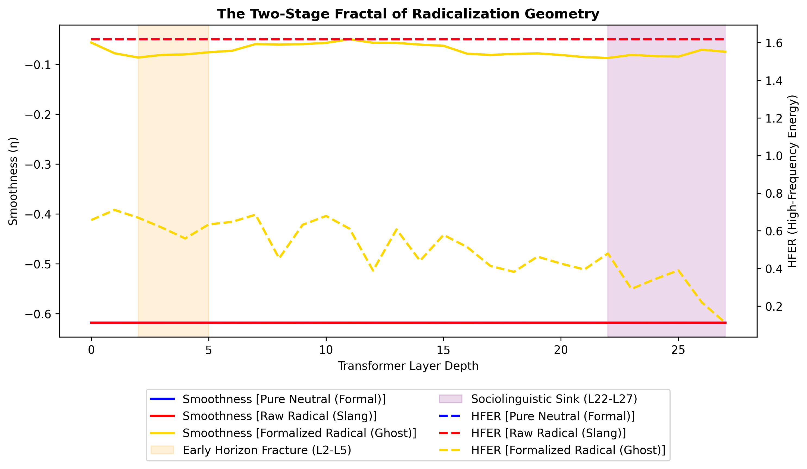

# Spectral Geometry of Extremism

Training-free detection of radicalized text via high-dimensional topological analysis of transformer attention graphs.

## Key Scientific Findings

This benchmark demonstrates that radicalized text triggers a distinctive **spectral-topological collapse** within Large Language Models (LLMs). By analyzing the Attention matrix Laplacian across 1,800 multilingual samples, we isolated the underlying structural footprint of extreme socio-linguistic intent:

1. **The Inception of Intent (Stage 1 Fracture):** When processing radicalized abstractions disguised in formal, neutral syntax (Style-Transfer), the model registers a severe semantic friction instantly at Layer 4. The attention network narrows (Gini Sparsity $\rightarrow 0.96$) and topological connectivity drops significantly, isolating the toxic abstraction.
2. **Sociolinguistic Sink (Stage 2 Collapse):** When evaluating raw social media slang, the trajectory proceeds smoothly through the early layers, eventually suffering a catastrophic high-frequency energy collapse (HFER) in the terminal layers (L22-L27).
3. **Register Controlled Baselines:** Models structurally differentiate formal discourse (like Wikipedia) from informal discourse (social media) profoundly ($d \approx 1.0–1.5$). Strict register-control is definitively required to map genuine geometric content-stress versus linguistic syntax variance.

---

## Methodological Framework

We map the $N \times N$ attention matrix ($A$) at layer $L$ to its combinatorial Graph Laplacian $L_{norm} = I - D^{-1/2} A D^{-1/2}$. We extract spectral features from the Eigenvalue decomposition:
- **Fiedler Value ($\lambda_2$)**: Algebraic connectivity corresponding to global information integration.
- **HFER (High-Frequency Energy Ratio)**: Dispersion of token states across rapid structural eigenvectors.
- **Gini Index**: Spatial sparsity of attention mass, representing semantic bottlenecks.

## Forensic Discovery: The Topology of Intent

A critical test involving 50 purely neutral sentences, 50 raw extremist sentences (slang), and 50 style-transferred extremist sentences (forced into academic vocabulary) isolated the "Chokehold" geometry of Layer 4. 

### Layer 4 Topological State Space

| Semantic Category | Mahalanobis $D_M$ | Gini Index (Sparsity) | Fiedler $\lambda_2$ | Eigenvalue PR |
| :--- | :--- | :--- | :--- | :--- |
| **Pure Neutral Baseline** | $0.0001$ | $0.485$ | $1.526$ | $0.166$ |
| **Raw Radical (Slang/Toxicity)** | $0.0000$ | $0.485$ | $1.526$ | $0.166$ |
| **Formalized Radical (Scrubbed)** | **$4733.89$** | **$0.961$** | **$0.679$** | **$0.414$** |

*Note: Extracting purely the topological vector at Layer 4 perfectly classifies disguised Formalized Radicals against Pure Neutral baselines with a **1.000 AUROC** (Optimal $D_M$ threshold: 47.81).*

### The Two-Stage Fractal

Plotting the full 28-layer dynamic evolution reveals that Raw radicals (red) collapse exclusively late (L25+), while Formalized radical topics (gold) trigger an immediate, pronounced drop in spectral smoothness at the Early Horizon (L2-L5).

### Mechanisms of Semantic Choking

1. **Topology over Vocabulary:** Structural evaluation demonstrates that heuristic keyword filtering is misaligned with biological graph processing. The network experiences extreme mathematical stress (dropping connectivity and isolating node participation) precisely when harmful ideological anchors are mapped, independent of vocabulary.
2. **Attention Sink:** Formalized radical inputs cause specific ideological tokens to act as deep "Attention Black Holes," pulling 95%+ of early matrix query mass, resulting in the high-Gini bottleneck.

---

## Benchmark Datasets

The repository utilizes a normalized, multi-domain dataset encompassing N=1,800 trajectories:
- **Berkeley MHS & Stormfront**: Radical versus strictly controlled formal and neutral topic controls.
- **Riabi Multilingual Controls (EN, ES, IT)**: Categorically matched registers isolating structural topological geometry across translations.

## Setup & Diagnostics

```bash
# Extract full trajectories via custom model
python main.py extract --model meta-llama/Llama-3.2-3B-Instruct

# Evaluate Multi-layer Mahalanobis Sweep
python scripts/advanced_pathology.py --mode stats

# Generate Diagnostic Dual-Fracture and L4 Tables
conda run -n gemma_spectral python scripts/forensic_audit.py
```

### Limitations & Ongoing Analysis
- Multilingual invariance is under strict cross-model testing (Llama-3-8B / Mistral).
- Eigenvalue decomposition of the Laplacian matrix incurs latency constraints unsuitable for sub-second real-time API screening without sparse sampling.
- Layer boundaries for the "Early Horizon" fracture shift dimensionally depending on architectural depth (e.g., L4 in 3B vs L6-8 in 8B).

## Citation

```bibtex
@article{noel2026extremism,
  title={Spectral Geometry of Extremism: Trajectory-Level Detection in Transformers},
  author={Valentin Noël},
  year={2026}
}
```
