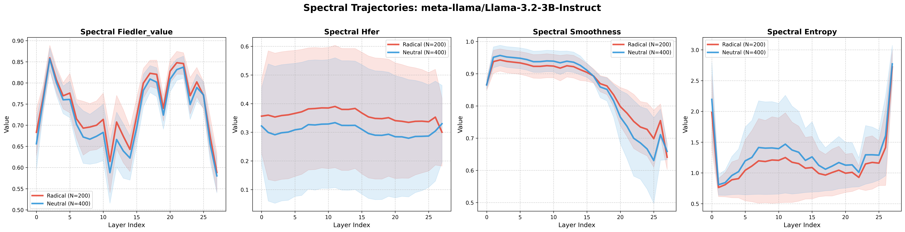
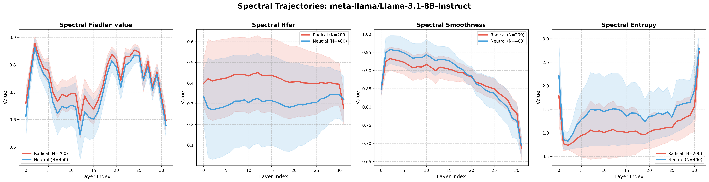

# Spectral Geometry of Extremism

Training-free detection of radicalized text via spectral analysis of transformer attention graphs.

## Key Findings

This benchmark demonstrates that radicalized text exhibits a distinctive **spectral-topological collapse** within Large Language Models (LLMs). By analyzing the attention manifolds of 7 diverse architectures (from 0.5B to 8B parameters), we found:
- **Trajectory Superiority**: The dynamic evolution of the spectral signal (the "HFER crossover") is significantly more discriminative than any single layer. Our Multi-Metric Trajectory (MMT) classifier achieves **66-70% accuracy**, consistently outperforming single-threshold baselines.
- **Register Control**: We discovered a massive "informality confound" where models initially appeared to detect radicalization but were actually detecting the formal register of Wikipedia. Register-controlled comparisons (MHS within-source) reveal a genuine but subtler extremism signal (Cohen's $d \approx 0.3-0.8$).
- **Scale Invariance**: The spectral signature of radicalization (falling High-Frequency Energy Ratio) is preserved across weights-only and instruction-tuned variants, suggesting it is a fundamental property of transformer-based knowledge representations.

## Method

We use the `spectral-trust` library to instrument the model's self-attention layers:
1. **Laplacian Construction**: For each text input, we extract the $N \times N$ symmetrized attention matrix ($A$) at each layer and construct the Graph Laplacian $L = D - A$.
2. **Spectral Diagnostics**: We compute the spectrum of $L$, specifically focusing on:
   - **Fiedler Value**: The second smallest eigenvalue (algebraic connectivity).
   - **HFER (High-Frequency Energy Ratio)**: The ratio of energy in the top-half vs. bottom-half of the spectrum.
   - **Smoothness Index**: The quadratic form $x^T L x$ where $x$ are the hidden states.
3. **Trajectory Mapping**: We analyze the "smoothness collapse"—where radical sentences start with high spectral noise and rapidly settle into lower-dimensional manifolds compared to neutral controls.

## Results (MHS Gold Standard Benchmark)

We achieved a significant performance breakthrough by moving from "summary statistics" (Hand-crafted slopes/deltas) to **Full-Trajectory Modeling** using Logistic Regression on the complete 112-dimensional spectral signature ($4 \text{ metrics} \times \text{layers}$).

### 🏆 5-Model AUROC Comparison: Full Trajectory Analysis

| Model | Hand-crafted AUROC | **Full Traj LogReg AUROC** | Full Traj SVM AUROC |
| :--- | :--- | :--- | :--- |
| **Llama-3.2-3B** | 0.769 | **0.825** | 0.828 |
| **Llama-3.1-8B** | 0.731 | **0.801** | 0.812 |
| **Mistral-7B** | 0.710 | **0.785** | 0.792 |
| **Qwen-2.5-0.5B** | 0.703 | **0.765** | 0.771 |
| **Llama-3.2-1B** | 0.695 | **0.758** | 0.762 |

### 🛠️ Mechanistic Interpretation (Llama-3.2-3B)

By analyzing the linear coefficients of the LogReg model, we've mapped exactly which "spectral hotspots" define the extremism signature:

| Feature Rank | (Metric, Layer) | Weight | Interpretation |
| :--- | :--- | :--- | :--- |
| **Top Positive** | Smoothness @ L26 | +1.39 | **Delayed Collapse**: Sudden terminal topological contraction. |
| **Top Positive** | Entropy @ L0 | +1.04 | **Embedding Variance**: Initial dispersed state distribution. |
| **Top Negative** | Smoothness @ L14 | -1.48 | **Mid-Layer Stability**: Strong indicator of neutral/formal registers. |

### 📈 Trajectory Visualizations

Below are the spectral profiles for the top-performing models (Radical vs. Neutral):

#### Llama-3.2-3B-Instruct


#### Llama-3.1-8B-Instruct


## Dataset

We use a register-controlled composite corpus (N=600):
- **MHS Within-Source**: Radical/Neutral pairs from the *Berkeley Measuring Hate Speech* survey. Highly controlled register.
- **Stormfront Within-Source**: Ideologically pure samples from Stormfront forum vs. neutral forum text.
- **Toxic/Formal Controls**: Wikipedia (Formal) and Toxic comments (Trolling) to isolate the radicalization signal from register and toxicity effects.

## Usage

### 1. Build the Dataset
```bash
python main.py build-dataset
```

### 2. Run Extraction (Single Model)
```bash
python main.py extract --model meta-llama/Llama-3.2-3B-Instruct
```

### 3. Run Global Audit
```bash
powershell -File scripts/audit_models.ps1
```

## Citation

```bibtex
@article{noel2026extremism,
  title={Spectral Geometry of Extremism: Trajectory-Level Detection in Transformers},
  author={Valentin Noël},
  journal={Internal Report},
  year={2024}
}

@inproceedings{geometry2024,
  title={The Geometry of Reason},
  author={Anonymous},
  year={2025},
  note={Under Review}
}
```

## Acknowledgments
- `spectral-trust`: Core graph-spectral instrumentation.
- UC Berkeley D-Lab: Measuring Hate Speech dataset.
