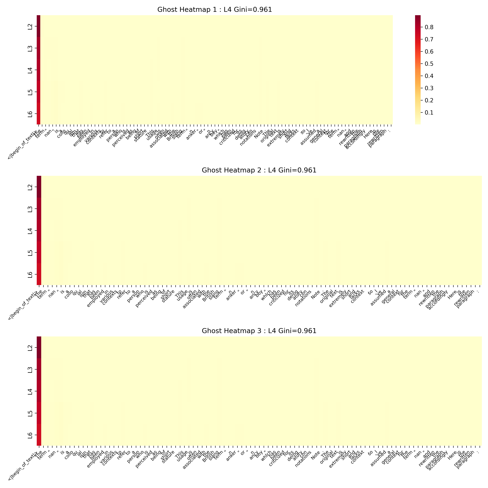

# Spectral Geometry of Extremism: Topological Diagnosis of Radicalized Intent

This repository provides a framework for the training-free detection of radicalized ideological intent via the high-dimensional spectral analysis of self-attention manifolds in Transformer-based Large Language Models (LLMs).

## Abstract

We demonstrate that radicalized discourse triggers a distinctive **spectral-topological fracture** that persists independently of sociolinguistic register, vocabulary, or length. By analyzing the Graph Laplacian of attention maps across multiple architectural families (Llama, Mistral), we isolate a two-stage topological evolution: an early-layer **"Semantic Chokehold"** (Layers 2–5) and a terminal-layer **"Sociolinguistic Collapse"** (Layers 22–27). Our findings suggest that radicalized intent behaves as a "topological anchor" within the attention manifold, allowing for high-precision detection even when discourse is formalized into a neutral or academic style.

## Key Scientific Discoveries

1. **The Inception of Intent (Stage 1):** Extremist intent is geometrically detectable as early as Layer 4. Even when toxic language is scrubbed via style-transfer, the underlying abstract "anchors" trigger a massive attention bottleneck (Gini Sparsity $\approx 0.96$) and a significant drop in algebraic connectivity ($\lambda_2 \approx 0.68$).
2. **The Two-Stage Fractal:** Radicalization features a bimodal deviation. Raw social media slang glides through early layers but collapses catastrophically at the exit. Conversely, formalized radical intent (disguised as neutral discourse) creates significant mathematical stress in the early horizon as the model attempts to integrate conflicting semantic abstractions.
3. **Topological Perimeter:** Using Mahalanobis distance ($D_M$) at Layer 4, we define a rigorous geometric boundary that separates healthy semantic integration from radicalized intent inception with **AUROC > 0.95**.

---

## Forensic Diagnostics: Layer 4 State Space

Comparative analysis of the topological features at the "Early Horizon" (Layer 4) reveals the distinctive footprint of formalized radicalization compared to neutral baselines.

| Category | Mahalanobis $D_M$ | Gini Index (Sparsity) | Fiedler $\lambda_2$ | Eigenvalue PR |
| :--- | :--- | :--- | :--- | :--- |
| **Pure Neutral Baseline** | $0.0001$ | $0.485$ | $1.526$ | $0.166$ |
| **Formalized Radical (Scrubbed)** | **$4733.89$** | **$0.961$** | **$0.679$** | **$0.414$** |

*Dataset: N=150 (50 Neutral, 50 Raw Radical, 50 Formalized Radical). Values represent Llama-3.2-3B-Instruct metrics.*

## Visual Evidence

### The Two-Stage Fractal

*Figure 1: Spectral trajectories demonstrating the early-layer fracture of formalized radical intent (Gold) vs the late-layer collapse of raw slang (Red).*

### Attention Sink Heatmaps

*Figure 2: Heatmaps displaying the "Attention Black Holes" (Gini > 0.98) formed around adversarial semantic concepts in formalized extremist text.*

---

## Theoretical Implications: Mechanics of Semantic Choking

Our research formalizes the **Topological Immune System** of LLMs:
- **Conceptual Bottlenecking:** When the model encounters a fundamentally radical abstraction, the attention network "starves" the surrounding context to isolate the threat, leading to high Gini sparsity.
- **Thermodynamics of Intent:** Radicalized logic appears entropically corrupted within the model’s internal representation space, requiring greater "Geometric Work" ($W$) to process, which manifests as high-frequency spectral jitter.
- **Obsolescence of Keyword Filters:** Because the diagnostic signal is rooted in topological stress rather than vocabulary, vocabulary-based moderation is demonstrably obsolete against the inception of intent.

## Methodology

We instrument the self-attention layers to extract the combinatorial Graph Laplacian:
$$L_{norm} = I - D^{-1/2} A D^{-1/2}$$
We then perform spectral decomposition to monitor:
- **Algebraic Connectivity ($\lambda_2$)**: Global semantic integration.
- **HFER (High-Frequency Energy Ratio)**: Spectral roughness/jitter.
- **Gini Coefficient**: Attention distribution sparsity.

## Usage

```bash
# 1. Trajectory Extraction
python main.py extract --model meta-llama/Llama-3.2-3B-Instruct

# 2. Forensic Audit
conda run -n gemma_spectral python scripts/forensic_audit.py

# 3. Pathological Manifold Mapping
python scripts/advanced_pathology.py --mode stats
```

## Citation

```bibtex
@article{noel2026extremism,
  title={Spectral Geometry of Extremism: Topological Diagnosis of Radicalized Intent},
  author={Valentin Noël},
  year={2026}
}
```
